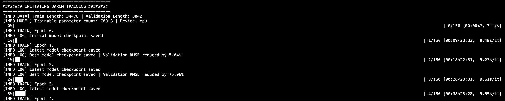
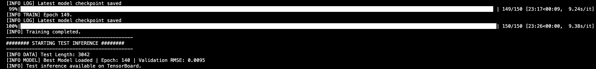
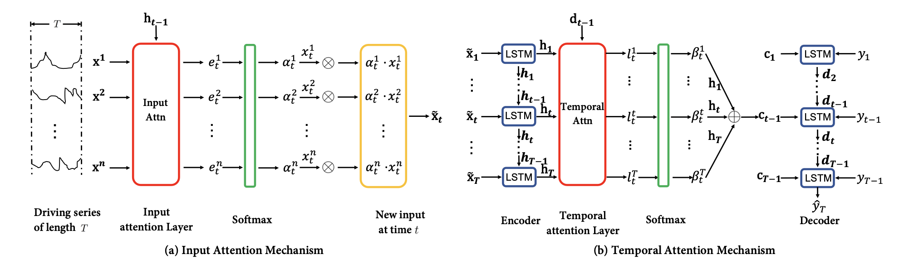
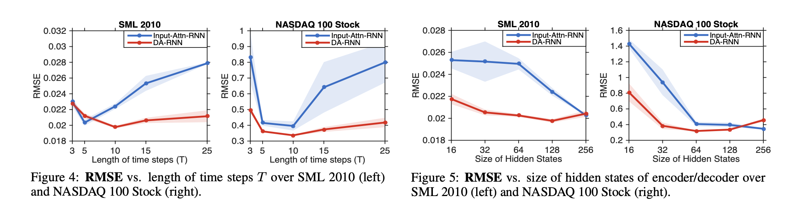
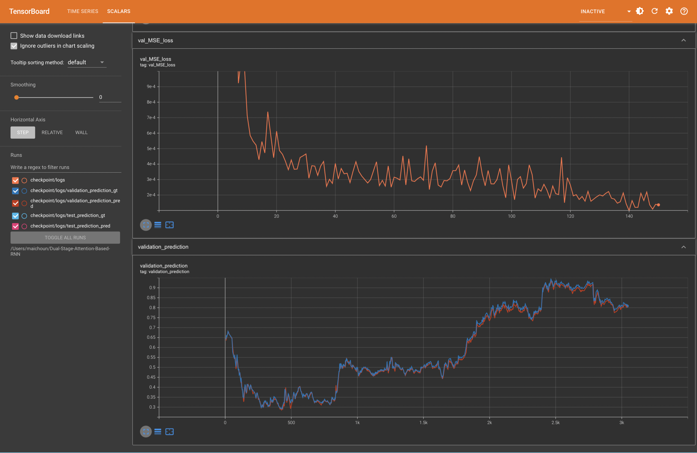
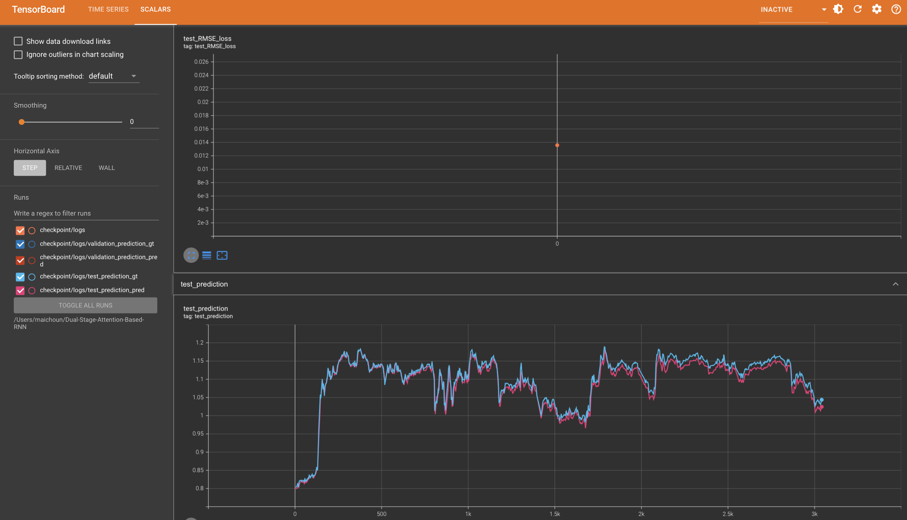

# Dual-Stage-Attention-Based-RNN

Develop a deep learning model for intraday time series forecasting, tracking progress during training with TensorBoard integration.


# Table of Contents

1. [Quickstart Guide](#quickstart-guide)
2. [File Structure Information](#file-structure-information)
3. [Model Overview](#model-overview)
4. [TensorBoard](#tensorboard)
5. [Further Thoughts](#further-thoughts)


# Quickstart Guide

To get started, clone the repository and install the required packages:

```bash
$ git clone https://github.com/michaelacn/Dual-Stage-Attention-Based-RNN.git
$ cd Dual-Stage-Attention-Based-RNN
$ pip install -r requirements.txt
$ python3 train.py
```

Then, the code proceeds through 2 distinct steps:

### Step 1: Model Training



### Step 2: Test Inference




# File Structure Information

### `train.py`
Manages model deployment, handling data loading, initialization, training, validation, and testing.

### `config/`
Customize hyperparameters, training settings, and data paths via YAML configuration.

### `lib/`
Contains custom modules for the project, including data preprocessing, model architecture and training utilities.

### `md_resources/`
Stores images used in the Markdown documentation to provide visual support and clarity.

### `requirements.txt`
A file listing all the necessary Python dependencies for the project.

### `nasdaq100_padding.csv`
Contains minute-by-minute intraday data for 81 major NASDAQ 100 companies and the overall index, spanning 105 days from July 26 to December 22, 2016.


# Model Overview

### Network Structure



- **Input Attention Mechanism:** Computes attention weights $\alpha_{t}$ for multiple driving series based on the previous encoder hidden state $h_{t-1}$, and feeds the weighted input $\tilde{x}_t$ into the encoder LSTM unit.

- **Temporal Attention System:** Computes attention weights $\beta_{t}$ from the previous decoder hidden state $d_{t-1}$, summarizes encoder states across time, and feeds the context vector $c_t$ into the decoder LSTM to produce the predicted output $\hat{y}_T$.

### Hyperparameters selection

The model is configured with a timestep length of 10 and a hidden state size of 64, selected as the optimal settings based on research findings across two datasets. You can easily explore different configurations by adjusting the YAML file.




# TensorBoard

### Monitor Training

Track validation MSE across epochs by refreshing the page to effectively assess training progress.



### Evaluation Results

Access the model predictions on the test set at the end of training, along with the associated performance metrics.




# Further Thoughts

Here are some potential extensions to consider:

- Develop and benchmark alternative time series forecasting architectures, such as Temporal Convolution Networks.
- Evaluate model performance across diverse datasets.
- Retrain the model with various hyperparameter combinations to ensure robustness.

  
# Bibliography

Yao Qin, Dongjin Song, Haifeng Cheng, Wei Cheng, Guofei Jiang, Garrison W. Cottrell. A Dual-Stage Attention-Based Recurrent Neural Network for Time Series Prediction. IJCAI 2017. https://www.ijcai.org/proceedings/2017/0366.pdf
